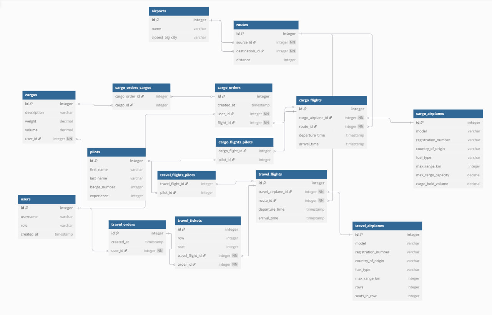

# Airport Management API

## 📦 Project Description

**Airport Management API** is a core part of a broader air logistics and operations platform. It manages essential data related to airports, routes, cargo and passenger flights, pilots, aircraft, and orders. This service forms the foundation for planning and managing air transportation operations.

### Features:
- Manage airport records and their closest major cities
- Define flight routes between airports
- Schedule cargo and passenger flights
- Handle cargo and passenger travel orders
- Assign pilots to specific flights
- Track aircraft capacities and technical specs

## 🧩 Database Schema



### Core Entities:
- `airports`: List of airports with nearest major cities
- `routes`: Defines source and destination airports with distances
- `cargo_airplanes` / `travel_airplanes`: Different aircraft models for cargo and travel
- `cargo_flights` / `travel_flights`: Flights with timestamps and linked routes
- `cargo_orders` / `travel_orders`: User-initiated shipping and travel orders
- `cargos`: Cargo details linked to orders
- `travel_tickets`: Seat information linked to travel orders
- `users`: End-users placing orders
- `pilots`: Pilots with experience and ID numbers

## 🚀 Getting Started

### Requirements:
- Docker
- Docker Compose

### Launch Instructions:

1. Clone the repository:

   ```bash
   git clone https://github.com/PrimeGlorious/Airport-Management-Api.git
   cd Airport-Management-Api